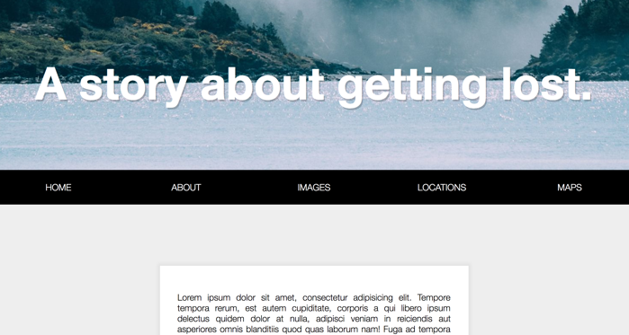
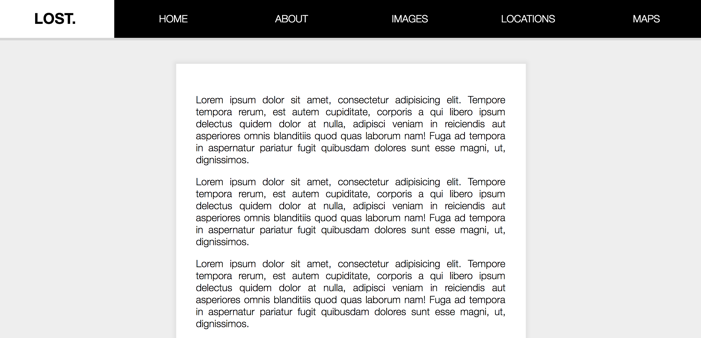

## JavaScript30 Day 24 - Sticky Nav

In this tutorial, we learn to create a sticky navigation. We have a static navigation positioned at the bottom of hero image. Once the navigation hits the top of the browser, we are going to make it fixed so that the content is going to scroll underneath of the navigation.

[View demo site here.](https://webdevtuts.github.io/javascript30_24/)

Webpage state on page load

Navigation bar become fixed position when scroll down towards content section

